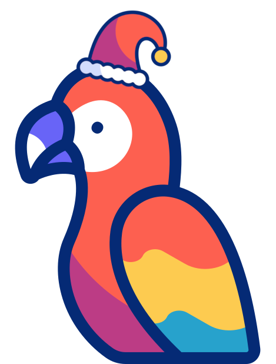

# TonieToolbox 🎵📦

[](https://github.com/TonieToolbox/TonieToolbox/actions)
[](https://github.com/TonieToolbox/TonieToolbox/actions)
[](https://www.gnu.org/licenses/gpl-3.0)
[](https://badge.fury.io/py/tonietoolbox)
[](https://www.python.org/downloads/)
[](https://hub.docker.com/r/quentendo64/tonietoolbox)

A powerful toolkit for converting audio files to Tonie-compatible TAF format and integrating with [TeddyCloud](https://github.com/toniebox-reverse-engineering/teddycloud).

# Merry Christmas 🎄🎉



As a special holiday gift to myself, I am proud to announce the alpha release of **TonieToolbox v1.0.0a1**! This is a complete rewrite of the TonieToolbox.

## ✨ What's New in v1.0.0a1
- 🎨 **New GUI Interface** - User-friendly graphical interface
- 🖥️ **Enhanced Desktop Integration** - Context menu support for Windows and Linux
- 🔍 **Code Completion** - Shell completion scripts for bash, zsh, pwsh and fish
- 🏗️ **New Architecture** - Complete new codebase *HOLY MOLY*
- ⚙️ **Centralized Configuration** - Unified settings management

# Alpha Release Notice
This is an alpha release of TonieToolbox v1.0.0a1. While core functionalities such as audio conversion and TeddyCloud upload have been tested, some advanced features may still be under development or require further testing. Users are encouraged to report any issues or feedback to help improve the TonieToolbox.


## 🚀 Quick Start

### GUI Mode (Recommended for Beginners)
```bash
pip install tonietoolbox
tonietoolbox --gui
```
Simply drag and drop your audio files!

### Command Line
```bash
# Convert a single file
tonietoolbox input.mp3

# Convert entire folders
tonietoolbox --recursive /path/to/audio/folders

# Upload to TeddyCloud
tonietoolbox input.mp3 --upload https://teddycloud.local --include-artwork
```

## 📖 Documentation

| Resource | Description |
|----------|-------------|
| 📚 **[Complete Documentation](https://tonietoolbox.github.io/TonieToolbox/)** | Full user guide |
| 🔰 **[Beginner's Guide](https://tonietoolbox.github.io/TonieToolbox/getting-started/)** | Step-by-step instructions for new users |
| 🛠️ **[Contributing](CONTRIBUTING.md)** | Guidelines for contributors |
| 📋 **[Changelog](CHANGELOG.md)** | Version history and updates |

## 🎯 Key Features

- **🔄 Audio Conversion** - Convert MP3, FLAC, WAV, and more to TAF format
- **📁 Batch Processing** - Handle entire music libraries recursively
- **🎨 GUI Interface** - Drag-and-drop simplicity with visual feedback
- **☁️ TeddyCloud Integration** - Direct upload with artwork support
- **🏷️ Smart Tagging** - Use audio metadata for intelligent file naming
- **🖥️ Desktop Integration** - Right-click context menus across platforms
- **🔍 Analysis Tools** - Validate, split, and compare TAF files
- **🐳 Docker Support** - Cross-platform containerized execution

## 💿 Installation

### PyPI (Recommended)
```bash
pip install tonietoolbox
```

### Docker
```bash
docker pull quentendo64/tonietoolbox:latest
```

### From Source
```bash
git clone https://github.com/TonieToolbox/TonieToolbox.git
cd TonieToolbox
pip install -e .
```

## 🎯 Common Use Cases

- **📚 Audiobook Collections** - Convert and organize audiobook series
- **🎵 Music Libraries** - Process entire music collections with metadata
- **🎭 Children's Stories** - Create custom Tonie content for kids  
- **🎪 Podcast Archives** - Convert podcast episodes for offline listening

## 🔧 Requirements

- Python 3.12+
- FFmpeg (auto-downloadable with `--auto-download`)

## 🤝 Community & Support

- **🐛 [Issues](https://github.com/TonieToolbox/TonieToolbox/issues)** - Bug reports and feature requests
- **💬 [Discussions](https://github.com/TonieToolbox/TonieToolbox/discussions)** - Community Q&A and ideas
- **📖 [Documentation](https://tonietoolbox.github.io/TonieToolbox/)** - Complete user guide

## ⚖️ Legal Notice

This project is independent and not affiliated with tonies GmbH. tonies®, toniebox®, and related trademarks belong to [tonies GmbH](https://tonies.com). Use responsibly with legally owned content only.

## 🙏 Attribution

- [Parrot Icon](https://www.flaticon.com/free-animated-icons/parrot) by Freepik - Flaticon
- Inspired by [opus2tonie](https://github.com/bailli/opus2tonie) and the [teddycloud](https://github.com/toniebox-reverse-engineering/teddycloud) projects